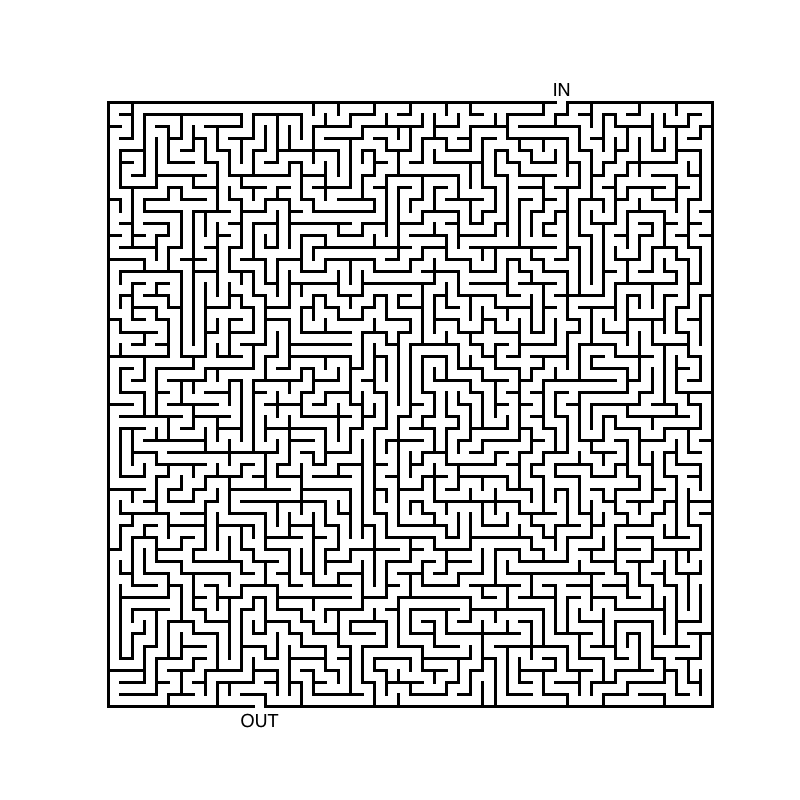
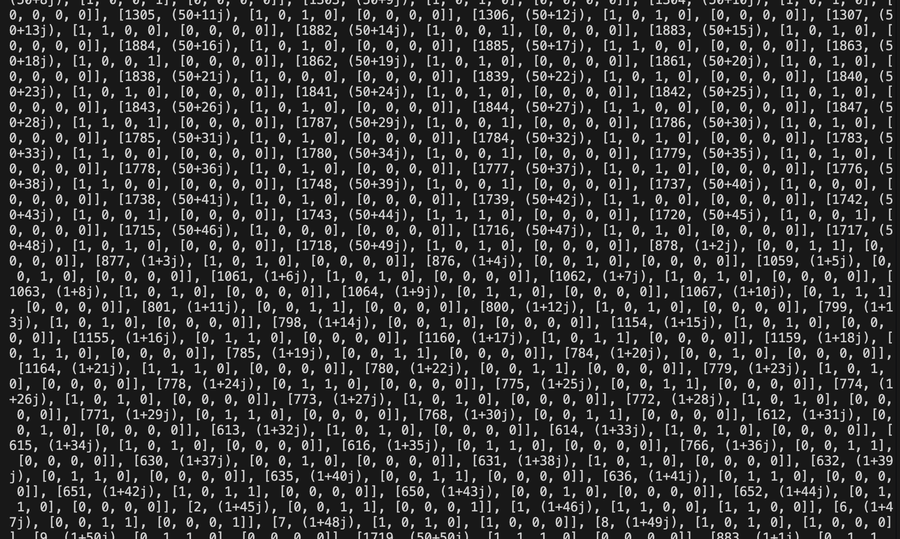

# Labyrinth

Generation of a *perfect maze* using iterative Depth-First Search (DFS) with explicit backtracking, developed in Python.

For a full description of the algorithm and its design choices, read the article on <br>
chorax.it: [Programmare in Python: 2. Labirinto](https://chorax.it/codice-e-creativita/programmare-in-python-2-labirinto/)

▶ [Run on Replit](https://replit.com/@alessioseveri27/Labirinto)


## How it works

The maze is generated cell by cell using an iterative DFS with explicit backtracking. Each cell selects an available direction, opens the shared wall and moves forward. When no directions are available, the algorithm backtracks to the previous cell until all cells have been visited.

Cells are identified by complex coordinates (x + y·j). Each cell contains: visit id, position, walls and possible directions, where walls are ordered [East, North, West, South].

## Result

<div align="center">
  
  <br><br>
  
</div>

## Requirements

```
pip install matplotlib
```

## Usage

Configure the maze size in the source file:

```python
XCOLONNE = 50
YRIGHE = XCOLONNE
```

These values can be changed to obtain mazes of different sizes, including rectangular ones. The current dimensions are optimized for balanced execution; larger values have not been tested and may require significant computational resources.

Run the program:

```
python3 Labirinto.py
```

The program saves a PNG image of the maze in the execution directory as `labirinto.png`.

To display the maze on screen instead of saving it, comment the save line and uncomment the show line in the source:

```python
# plt.savefig(...)   # comment to disable saving
plt.show()           # uncomment to display on screen
```

To disable the textual printout of the grid (used for analysis and debug), which lists each cell in the form `[id, (x+yj), [E, N, W, S], ...]`, comment the following line:

```python
# print(_reticolo)
```

## License

© 2025 Alessio Severi — released under the [MIT License](LICENSE).
